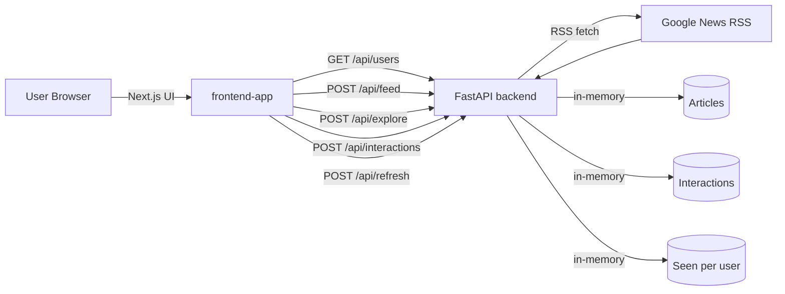
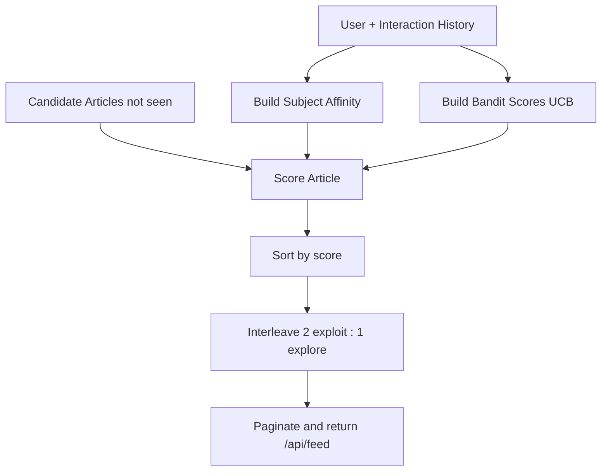
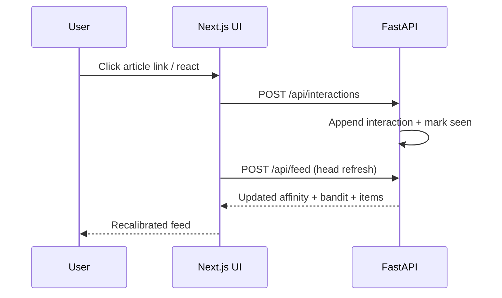
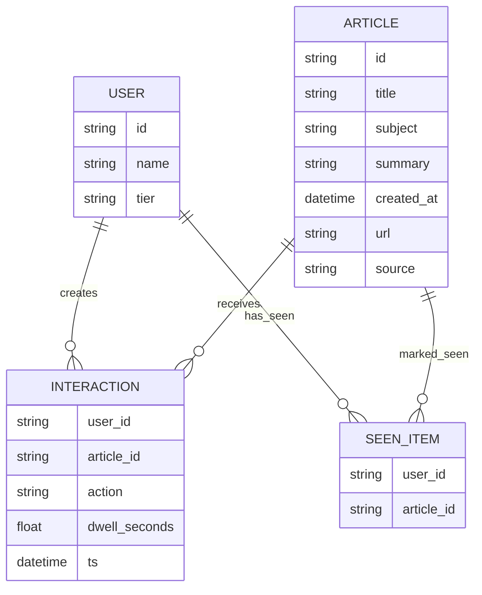

# DailyLens: News Feed Ranker and Discovery Website

A full-stack news/article discovery product prototype with:
- `FastAPI` backend (Python)
- `Next.js + TypeScript + Tailwind` frontend (`frontend-app/`)
- Contextual bandit ranking for personalization + exploration
- Infinite scroll, interaction tracking, search, and open catalog exploration
- Simulated monetization: tier limits + ad-based free tier

---

## Documentation Map

For cross-functional alignment, use:
- `docs/README.md` (entry point)
- `docs/00-exec-summary.md`
- `docs/01-product.md`
- `docs/02-design.md`
- `docs/03-engineering.md`
- `docs/04-business.md`
- `docs/05-scaling-roadmap.md`
- `docs/06-operating-model.md`

---

## Product Overview

DailyLens is designed as a professional discovery experience, not a basic prototype app.

### Core user journeys
- Sign in as one of 5 simulated users (`u1` to `u5`)
- Create a new AI-focused user profile through onboarding
- Browse a ranked personalized feed with infinite scrolling
- Click article links (tracked as `view/read`)
- React with `like`, `save`, `share`, `skip`
- Search and explore beyond ranked feed using the open catalog
- Share referral code and simulate referral signups for renewal discounts
- Refresh news pool to ingest fresh live content
- Experience plan-based limits and ad behavior by tier

### Content coverage
- 12 subjects:
  - Engineering, Business, Sales, AI, Fitness, Finance, Marketing, Product, Science, Cybersecurity, Design, Miscellaneous
- Real posts from Google News RSS per subject
- Startup fallback generation if feeds are unavailable

### Monetization simulation
- Tier-based post limits (monthly):
  - Free: `5` posts/month
  - Silver: `50` posts/month
  - Gold: `Unlimited`
- 5 simulated users are pre-bucketed into tiers:
  - `u1` free, `u2` silver, `u3` gold, `u4` silver, `u5` free
- Free tier gets sponsored cards injected into feed/explore results
- Backend enforces limits on interaction (`POST /api/interactions`)

---

## Key Decisions Log

This section captures the key product, design, and engineering decisions taken so far.

### Product decisions
- Decided to build a **web product** (not Streamlit) with a production-style frontend and API backend.
- Decided to support two content modes:
  - Ranked personalized feed (`/api/feed`)
  - Open exploration catalog (`/api/explore`)
- Decided to keep 5 simulated users for demo realism and deterministic testing.

### Ranking decisions
- Chose a **multi-armed contextual bandit style approach** (UCB-inspired) over pure preference sorting.
- Combined signals:
  - subject affinity from behavior history
  - bandit uncertainty/novelty pressure
  - recency and controlled jitter for diversity
- Added explicit interleaving so exploratory topics appear in-session, not only at the tail.

### Data decisions
- Switched from fully synthetic article pool to **real RSS ingestion** by subject.
- Added fallback synthetic generation for resilience when RSS fetch is unavailable.
- Added text normalization to clean RSS mojibake/encoding artifacts (titles/summaries/sources).

### UX decisions
- Moved from minimal prototype UI to a professional Next.js app.
- Replaced crowded multi-panel layout with **tabbed views**:
  - `Feed`
  - `Explore`
  - `Insights`
  - `Monitoring`
- Made link click the canonical `view/read` interaction (removed explicit read button).
- Implemented responsive behavior for phone/tablet/laptop breakpoints.
- Reduced status churn/flicker by using silent background fetches for infinite scroll/refill.

### Monetization decisions
- Adopted a hybrid simulation:
  - tier-based access limits
  - ad-supported free tier
- Tier model:
  - Free: 5 posts/month
  - Silver: 50 posts/month
  - Gold: unlimited
- Enforced limits server-side at interaction time and exposed entitlement state in API responses.
- Added sponsored card injection for free-tier feed/explore results.

### Engineering decisions
- Kept backend state in-memory for prototype speed:
  - articles
  - interactions
  - seen-by-user
  - entitlement derived at runtime
- Added local v2 scalability simulation primitives:
  - feed page cache with TTL
  - precomputed per-user rank bundles with TTL
  - async event queue + worker for feature updates
  - per-user API rate limits on feed/explore
  - endpoint metrics + structured recent logs
- Added optional Kafka-compatible event pipeline for laptop use:
  - Redpanda broker via Docker Compose
  - Kafka producer on interaction write path
  - Kafka consumer worker for async feature updates
  - automatic fallback to local queue mode if Kafka is unavailable
- Added optional NoSQL persistence layer:
  - MongoDB backend (`DATA_BACKEND=mongo`) with schema-flexible documents
  - startup state load from MongoDB when available
  - write-through persistence for interactions and dynamically ingested articles
- Added `POST /api/refresh` to reload live content without server restart.
- Fixed Python runtime compatibility by avoiding non-portable typing patterns in API models.
- Corrected ad-pagination offset logic so sponsored cards do not skip organic feed items.

---

## Design and UX Changes

### Professional UI (`frontend-app/`)
- 2-column responsive shell:
  - Left rail: user/profile controls + plan/usage
  - Main content: tabbed discovery experience
- Distinct product sections:
  - `Feed` tab: `Top Picks` + `Explore New Domains`
  - `Explore` tab: search + `Open Catalog`
  - `New User` tab: onboarding + role/interests + optional referral code
  - `Insights` tab: affinity/bandit diagnostics
  - `Monitoring` tab: queue/cache health, endpoint latency/error stats, and logs
- Polished visual system:
  - Custom typography, gradients, glass panels, responsive layout
  - Reusable card/actions/chips patterns
- Interaction UX:
  - Article title click logs `view` and removes card
  - Feed replenishes when cards run low
  - Plan/usage panel shows tier, monthly usage, and remaining quota
  - Sponsored cards render with distinct visual treatment

### Legacy UI
- Original plain HTML/CSS/JS still available in `frontend/` for comparison.

---

## Ranking and Recommendation Engineering

### Behavior-only reward signals
User feedback updates recommendations using:
- `action` type (`view`, `like`, `save`, `share`, `skip`)
- `dwell_seconds`

### Ranking model
- Subject affinity from historical interactions
- UCB-style bandit scores under uncertainty
- Final score blends:
  - exploit signal (known preference)
  - explore signal (bandit novelty/uncertainty)
  - recency
  - light stable jitter for diversity

### Feed composition strategy
- Interleaving cadence to avoid monoculture:
  - approximately 2 exploit posts then 1 exploration post
- Goal: exploratory subjects appear in the middle of session flow, not only at the tail

### Exploration beyond ranked stack
- `POST /api/explore` supports:
  - full-text query
  - subject filter
  - include/exclude seen content
  - pagination
- On-demand ingestion path adds more live articles for richer search coverage (not limited to startup-ranked set)

---

## Engineering Architecture

## Architecture Diagrams

### 1) System Architecture (Mermaid)



### 2) Ranking and Interleaving Flow (Mermaid)



### 3) Interaction Feedback Loop (Mermaid)



### 4) System Architecture (ASCII)

```text
┌──────────────────────┐         HTTP          ┌─────────────────────────┐
│  Browser (Next.js)   │ ────────────────────► │   FastAPI Backend       │
│  frontend-app        │ ◄──────────────────── │  /users /feed /explore  │
└─────────┬────────────┘      JSON API         │  /interactions /refresh │
          │                                     └───────────┬─────────────┘
          │                                                 │
          │                                   fetch RSS     │
          │                                                 ▼
          │                                     ┌─────────────────────────┐
          └────────────────────────────────────►│   Google News RSS       │
                                                └─────────────────────────┘

Backend runtime state (in-memory):
- Articles
- Interactions
- Seen-articles-by-user
```

### 5) Data Model (Mermaid ER)



### 6) Data Model (ASCII)

```text
User (id, name, tier)
  1 ────────────────< many Interaction >─────────────── 1
Article (id, title, subject, summary, created_at, url, source)

Interaction (user_id, article_id, action, dwell_seconds, ts)

Seen (user_id -> set[article_id])  [in-memory index]
  - derived/updated from interactions and used to filter ranked feed

Entitlement (derived runtime per user):
- monthly_limit
- monthly_used
- monthly_remaining
- can_consume
- ad_enabled
```

### Backend (`backend/main.py`)
Responsibilities:
- Content ingestion (RSS)
- User/article/interaction simulation
- Bandit + affinity ranking logic
- Optional NoSQL persistence (MongoDB) with in-memory fallback
- Local v2 serving simulation (cache, precompute, event queue, rate limits)
- Operational telemetry (endpoint metrics + structured logs)
- Feed, explore, interaction, refresh APIs

Key endpoints:
- `GET /health`
- `GET /api/users`
- `POST /api/refresh`
- `POST /api/feed`
- `POST /api/explore`
- `POST /api/interactions`
- `GET /api/monitoring/dashboard`

### Frontend (`frontend-app/`)
Tech stack:
- Next.js App Router
- TypeScript
- Tailwind CSS + custom global styles

Client responsibilities:
- session/user selection
- ranked feed fetching + infinite scroll
- open catalog search and pagination
- event tracking for user interactions
- live display of affinity/bandit diagnostics
- monitoring dashboard (traffic, queue, cache, logs)

---

## Project Structure

- `backend/main.py`: API + ingestion + simulation + ranking
- `backend/requirements.txt`: backend dependencies
- `backend/run.sh`: backend runner
- `backend/run-mongo.sh`: backend runner with MongoDB persistence mode
- `docker-compose.nosql.yml`: local MongoDB + Mongo Express
- `frontend-app/`: recommended professional web UI
- `frontend/`: legacy minimal web UI

---

## Local Setup

## 1) Run Backend

```bash
cd Prototypes/news_feed_generator/backend
python3 -m venv .venv
source .venv/bin/activate
pip install -r requirements.txt
./run.sh
```

Backend: `http://localhost:8000`

### Optional: Run Backend with MongoDB (NoSQL persistence)

1. Start MongoDB locally:

```bash
cd Prototypes/news_feed_generator
docker compose -f docker-compose.nosql.yml up -d
```

2. Run backend in Mongo mode:

```bash
cd Prototypes/news_feed_generator/backend
source .venv/bin/activate
./run-mongo.sh
```

3. Optional data UI:
- Mongo Express: `http://localhost:8082`
- Env template: `backend/.env.mongo.example`

### Optional: Run Backend with Kafka-Compatible Queue (Redpanda)

1. Start Redpanda locally:

```bash
cd Prototypes/news_feed_generator
docker compose -f docker-compose.kafka.yml up -d
```

2. Run backend in Kafka mode:

```bash
cd Prototypes/news_feed_generator/backend
source .venv/bin/activate
./run-kafka.sh
```

3. Optional broker UI:
- Redpanda Console: `http://localhost:8081`
- Env template: `backend/.env.kafka.example`

## 2) Run Professional Frontend

```bash
cd Prototypes/news_feed_generator/frontend-app
npm install
npm run dev
```

Frontend: `http://localhost:3000`

Optional env var:

```bash
NEXT_PUBLIC_API_BASE=http://localhost:8000
```

## 3) Run Legacy Frontend (optional)

```bash
cd Prototypes/news_feed_generator/frontend
python3 -m http.server 5173
```

Legacy frontend: `http://localhost:5173`

---

## API Quick Reference

## `GET /api/users`
Response includes:
- `id`
- `name`
- `tier`
- `monthly_limit`
- `monthly_used`
- `monthly_remaining`

## `POST /api/feed`
Request:
```json
{ "user_id": "u1", "offset": 0, "limit": 10 }
```
Response includes:
- `items`
- `next_offset`
- `has_more`
- `subject_affinity`
- `exploration_subject_scores`
- `bandit_subject_scores` (legacy alias)
- `subject_pull_counts`
- `entitlement`
- `message` (present when limit reached)
- `items[*].is_sponsored`

## `POST /api/explore`
Request:
```json
{
  "user_id": "u1",
  "query": "ai",
  "subject": "AI",
  "include_seen": false,
  "offset": 0,
  "limit": 20
}
```
Response includes:
- `items`
- `next_offset`
- `has_more`
- `total`
- `subjects`
- `entitlement`
- `message` (present when limit reached)
- `items[*].is_sponsored`

## `POST /api/interactions`
Request:
```json
{ "user_id": "u1", "article_id": "a13", "action": "like", "dwell_seconds": 42.5 }
```
Notes:
- Article link click is recorded as `view`
- If limit is reached, endpoint returns `402` with upgrade details

## `POST /api/users/onboard`
Creates a new user profile from onboarding inputs:
```json
{
  "name": "Alex",
  "role": "ML Engineer",
  "interests": ["LLMs", "RAG", "MLOps"],
  "goal": "Stay current in AI in 10 minutes/day",
  "referral_code": "DL-U1"
}
```

## `POST /api/referrals/simulate-signup`
Simulates a referred signup and updates inviter renewal discount:
```json
{
  "inviter_user_id": "u1",
  "invitee_name": "AI User 1234",
  "invitee_role": "Data Scientist",
  "interests": ["LLMs", "Evaluation"]
}
```

---

## Troubleshooting

### `npm: command not found`
Install Node.js (macOS with Homebrew):

```bash
brew install node
```

Then verify:

```bash
node -v
npm -v
```

### No fresh articles
- Check internet access (RSS fetch requires network)
- Use `POST /api/refresh` to rebuild the news pool

### Search returns small result sets
- Try broader query terms
- Remove subject filter
- Enable `include_seen`

---

## Notes

- Real news is fetched at startup and optionally during explore expansion.
- Historical interactions are simulated initially, then updated live from user actions.
- Content consumed by a user is removed from ranked feed unless exploring with `include_seen=true`.
